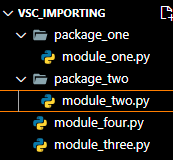

# Python   
## Introduction
Python is one of the most popular programming languages in the world, second only to Javascript in one study ([the study](https://bootcamp.du.edu/blog/in-demand-programming-languages/)). Youtube, Google, and other tech giants have made use of Python, and there is a high demand for the language in the market today. It was created by Guido Von Rosssum, who named it after "Monty Python's Flying Circus" because he wanted the langauge to be "fun". The language is easy to use, easy to read, and easy to jump into.

There are a few things to know about Python before jumping into the code itself:
1. Python is a "High Level" language
    - this means Python automates memory management for you. It assigns and frees memory for you so that you can focus on your coding. Freeing memory is called garbage collection
    - this allows for fast programming, but the tradoff is optimization: you can not min/max your performance efficency with a high level language like you can with a language like C++.
2. Python is a "Dynamic" language
    - You do not need to tell your code what type of data you are working with: Python handles that for you.
    - This is useful for speed and readability, but it has drawbacks
        - If you read code someone else developed you might have a harder time understanding what kind of data you are working with
        - Not having type security can lead to unexpected outcomes in your code
3. Python is a "Strongly Typed" language
    - Python will not implicitly coerce your data types: you must reassign variables if you want to change their type
4. Python is an "Interpreted" language
    - Python code is compiled and executed line by line, as opposed to the entirety of the code being compiled before run (like Java).
    - This is generally slower than a compiled language, but it does allow you to modularly test your application (can test one part without having to compile other parts)
    - You lose the benefits of having a compiler check your code for errors and/or optimize your code
## Identifiers
Identifiers are the names you give to variables, classes, functions, etc. They are user created names that reference something within your code. These identifiers must start with a letter, and there are some best practices for naming conventions:
- Classes and Exceptions: PascalCase (no spaces, uppercase first letter for each unique word)
- Constants: SCREAMING_SNAKE_CASE (no spaces, all uppercase letters, underscore seperates unique words)
- Everything else: snake_case (no spaces, all lowercase letters, underscore seperates unique words)
To create an identifier you simply have to use the assignment operator and define what you want the identifier to reference
```Python
my_identifier = "It is this easy"
```
You can add a type annotation that makes it easier for developers to know what you EXPECT the data type to be, but that is all the annotation accomplishes: It has no effect on the code itself.
```Python
my_number: int = 5
my_string: str = "This is a string"
my_string_number: float = "This is a string despite saying I expect a float"
```
## Key Words
Python has some reserved Key Words you do not want to try and overwrite: they provide functionality for your code
#### control flow
```Python
for # used if you want something to loop
in # use this when you want to reference something inside another element
while # use this when you want to loop for specified conidtion
```
#### exceptions
```Python
try # this is used to start your try except block. Use this when you think something can go wrong
except # use this to handle things going wrong
finally # use this when you need something to happen whether your code executes successfully or not
raise # use this to raise an exception
```
#### importing
```Python
from # use this to specify where you are importing your code from
import # use this to import your code
as # you can set a reference to whatever it is you are importing
```
#### logical operators
```Python
is # use this when you want a True result when A = B
is not # use this when you want a True result when A != B
and # use this when you want to set up multiple trigger conditions
or # use this when you want to set up multiple optional trigger conditiona
if # use this when you want code to run under specified conditions
elif # use this when you want code to run under conditions not covered by the if statement
else # use this to run code if your if and elif statements do not run
True # boolean indicating something is true
False # boolean indicating something is false
```
#### others
```Python
None # default function return value
pass # use this to ignore code
def # used to create functions
class # used to create classes
assert # used for testing to get a boolean result
break # used to escape a loop
```
## Operators
```Python
+ # addition
- # subtraction
* # multiplication
/ # division
** # power of
% # modulus
// # floor division
== # comparison operator
```
## Types and Values
Python is unique from many other programming languages in that it has no primative data types. Primatives are the most basic type of data that can be used in a programming language, and are built into their respective languages. Python forgoes this and makes everything an object. So if you create a reference for the number 5 you are creating a numeric object
```python
this_is_an_object = 5
```
There are a couple built in data types in Python:
```Python
# numeric datatypes are integer and float
my_integer = 1 # no decimal
my_float = 1.1 # can handle decimals

# String is the data type that handles words/text
my_string = "this handles words/text"

# booleans can either be True or False
my_true_boolean = True
my_false_boolean = False

# None can be assigned as a type: uesful for avoiding errors
my_none = None
```
## String Literals
Strings are one of, if not the most common data forms in coding. A string literal is the value of the string
```Python
my_string_literal = "the string literal is the content of the string"
```
You can get fancy with the way you create strings by doing string interpolation. String interpolation is adding variables into strings
```Python
my_basic_string = "No interpolation happening here"

# You can concatonate strings together by using the + operator
name = "Will"
greeting = "Hello " + name 

# if you place an f before the first quote you can make a formatted string
formatted_string = f"Hello {name}"

# you can also use the .format() method to format your string
formatted_by_method_string = "Hello {}".format("Will")
```
String slicing is where you work with a sub-string of a string (work with specific parts of a string)
```Python
my_string = "Hello Will"
just_hello = my_string[0:5] # this will read from the start to the 4th index position EXCLUDING the 5th element
just_will = my_string[6:10] # This will read from the 6th index to the last index position (notice it is one number larger than the string itself)

# use a negative number to work backwards in a string (-1 is the last element of the string)
using_negative_index = my_string[0:-1] # this will be "Hello Wil" because it goes up to and excludes the last index

# You can use a 3rd position to designate the increment steps (every other character, every third, etc)
every_other_letter = my_string[0::2] # this starts with the first character and appends every other letter after it

# you can also work backwards with the increment

reversed_letters = my_string[::-1]

# be careful you remember that the length of the string is not the same as the number of index positions
print(len(my_string)) # this is 10
print(my_string[10]) # this will cause an error, because indexing starts at 0

# finally, you can make anything in Python a string by calling the str() function on it

a_number = 3
print(type(str(a_number))) # this will return string, the method creates a string version of our object

```
____________________________________________________________________-
## Functions
Functions are blocks of code that can be reused in multiple locations. They are useful for reducing redundancy, and they can also be attached to classes to give them functionality.
```python
# to create a function you use the def keyword, name the function, give it ():, and then write the code with a single indent. Use the return key word if you want to return something specific
def basic_function():
    return "this is the basic function"

# you can add parameters to your function by adding them inside the ()
def basic_function_2(parameter):
    return parameter + 1 # you can add an argument to this function and get it back plus 1

# You can add type annotations to the parameters, and even declare a return type. This still has no actual effect on the code
def add_type_annotation(param1: str, param2: int) -> str:
    return "you are indicating you want a string and int param entered into this function and you expect a string back"

# if you add numeric types you will get addition, if you add strings you will get string concatonation
def annotations_dont_matter(num: int, num2: int) -> int:
    return num + num2
print(annotations_dont_matter(3,5)) # this works as expected
print(annotations_dont_matter("these"," are not numbers")) # this also works, despite types not matching annotation

# you can add a variable to the end of the paramaters called a variable argument, which takes an unspecified ammount of information in and places them inside a Tuple
def variable_arguments(*args): # use this vararg when you don't know how much information the function will work with
    for element in args:
        print(element)
variable_arguments(1,2,3,4,5)

def vararg_many_objects(*can_be_named_whatever): # the convention is to call it args, but you can name it what you want
    for element in can_be_named_whatever:
        print(element)

# you can mix and match data types in your vararg
vararg_many_objects(1,"two",3,"four")

# this allows you to enter information in key/value pairs. The kwargs is a dictionary
def key_word_function(**kwargs): # this adds key:value arguments into your function
    print(kwargs["password"])
    print(kwargs["username"])

key_word_function(password="my password", username="my username")

def more_kwargs(**kwargs):
    for key, value in kwargs.items():
        print(f"{key}:{value}")

more_kwargs(first_key="first value", second_key="second value", third_key="third_value")

# you can even add functions as arguments in your functions
def called_function():
    return"this is called by the outter function"

def calls_a_function(function):
    return function()


print(calls_a_function(called_function)) # leave off the parentheses: you want the reference for the function, not to call it
```
## Classes and Objects
You can bind variables and functions to classes in Python. This allows you to have more control over the flow of your code, and it especially allows for Object Oriented(esque) Programming. This is also useful if you need to model something in life within your program: it gives you a repeatable template to create a representation of the real life thing within your code
```python
# This needs to be added to the example when you get to abstract classes and methods
from abc import ABC, abstractmethod

# basic class syntax is the class keyword, ClassName:, init under method(add instance variables here), then associated functions
class MyNewClass:
    # this sets up the constructor for the class. There can only be one
    # notice you can set default values for parameters by declaring them within the ()
    def __init__(self, age=0, name="default name"):
        self.name = name
        self.age = age

    def my_new_class_function(jeeves):  # first parameter is always a reference to self, doesn't have to be called self
        return "this is my class function"

    # the __str__ method is used when you pass the object in the str() method. You can overwrite it to best suit your class
    def __str__(jeeves):
        return f"my name is {jeeves.name} and my age is {jeeves.age}"

    # the __repr__ method should allow you to create a clone of the class. I could create a new variable and call this method to create a clone of the object
    def __repr__(self):
        return f"MyNewClass(self,{self.age},{self.name})"

# the self parameter is included because Python, under the hood, is actually using the class to call the function, and the particular object you want to use is being passed in as the first argument
my_class = MyNewClass()
print(my_class.__str__()) # this is the same as below
print(MyNewClass.__str__(my_class)) # this is the same as the above

# Python supports abstract classes. You make a class abstract by adding ABC inside the parenthesis
class MyAbstractClass(ABC):
    
    # this is a class variable, accessed by calling the class itself, not an instantiated object
    class_count = 0

    # class methods take in the class as an implicit first argument, can interact with and change the state of the class
    @classmethod
    def print_class_count(cls): # still need to add a parameter for the class here
        return cls.class_count

    # abstract methods have no body: they need to be defined in their child class
    @abstractmethod
    def to_be_determined(self):
        pass

    # static methods are similar to class methods in that they are called by the class itself, but they do not recieve the class or an instance of the class as an IMPLICIT argument. You can add it, but might as well use a class method at that point
    @staticmethod
    def static_method():
        return "This is my static method, notice it does not interact with the state of the class"


class MyInheritsTheAbstractClass(MyAbstractClass):

    def __init__(self):
        print("I inherited from the abstract class")
        MyAbstractClass.class_count = MyAbstractClass.class_count + 1

    # you can now define what the abstract method does within the child class
    def to_be_determined(self):
        return "I have defined what this function actually does"


class AlsoInheritsAbstractmethod(MyAbstractClass):
    def __init__(self):
        print("I also inherited from the abstract class")
        MyAbstractClass.class_count = MyAbstractClass.class_count + 1

    def to_be_determined(self):
        return "I have also defined what this function does"


# my_class = MyInheritsTheAbstractClass()
# print(my_class.print_class_count())
# my_other_class = AlsoInheritsAbstractmethod()
# print(my_other_class.print_class_count())
# print(my_class.to_be_determined())
# print(my_other_class.to_be_determined())

class OuterClass:
    def __init__(self, number, word, inner_class="my inner class"):
        self.number = number
        self.word = word
        self.create_inner_class(inner_class)

    class InnerClass:
        def __init__(self, name):
            self.name = name
            print("the inner class has been created")

    def create_inner_class(self, name):
        self.inner_class = self.InnerClass(name)

    def __str__(self):
        return f"my number is {self.number}, my word is {self.word}, and my inner class is called {self.inner_class.name}"


# outter_class = OuterClass(5, "pie")
# print(str(outter_class))

class InheritedConstructor:
    def __init__(self, name):
        self.name = name
        print("the parent constructor was called")


class Inheritsconstructor(InheritedConstructor):
    def __init__(self, age, name):
        # super(Inheritsconstructor, self).__init__(name)
        super().__init__(name)
        self.age = age
        print("the child class constructor was called")

class A:
    def __init__(self):
        print("parent constructor was called")

class B(A):
    def __init__(self):
        super(B, self).__init__()
        print("the child was called")

# Python supports multiple inheritance, but it can get real messy real quick. Avoid it if you can early in the training

# you can explicitly call each parent constructor within the child constructor to make multiple inheritance work

class Class1:
    def __init__(self, name) -> None:
        self.name = name
        print("Class1 constructor called")

class Class2:
    def __init__(self, age) -> None:
        self.age = age
        print("Class2 constructor called")

class Person(Class1, Class2):
    # make sure you declare the parameters that match the parent constructors
    def __init__(self, name, age) -> None:
        Class1.__init__(self,name)
        Class2.__init__(self,age)
        # anything pertinent to this class in particular goes after the parent constructors
        print("Person Constructor finished")

my_person = Person("Will", 27)
print(my_person.name) # shows Will
print(my_person.age) # shows 27

# you can also use mixin classes to manage multiple inheritance. This can make for a cleaner child class, but the logic has to be spot on
class ClassMixin:
    # notice this takes in varargs parameter(and or a kwargs argument): this allows any unused arguments within the child to be passed to the next constructor
    def __init__(self, name, *args, **kwargs) -> None:
        super().__init__(*args, **kwargs)# this handles passing the remaining arguments to the next constructor
        self.name = name
        print("mixin class constructor was called")

class AgeMixin: # NOTICE: ONLY USE *ARGS AND SUPER WHEN YOU ADD THE PLEASESTOP CLASS TO THE INHERITANCE
    
    def __init__(self, age, *args) -> None:
        super().__init__(*args) 
        self.age = age
        print("not mixin class was called")

class PleaseStop:
    def __init__(self, hair_color) -> None:
        self.hair_color = hair_color
        print("just stop")

class MixAndNotMixCombined(ClassMixin, AgeMixin, PleaseStop):
    def __init__(self, name, age, hair_color) -> None:
        super().__init__(name, age, hair_color)
        print("Their child was called")

my_mixin_object = MixAndNotMixCombined("Will", 27, "blond")
print(my_mixin_object.name)
print(my_mixin_object.age)
print(my_mixin_object.hair_color)

# this process can become even more convoluted when you you have classes that inherit a class that are inherited by their own class (A is inherited by B and C, which are both inherited by D). This creates the diamond problem, but Python can manage it under the hood. It does require spot on logic in your code though

class A: # this is the top level class: notice we have made it a mixin class to accomodate the multiple inheritance
    def __init__(self, variable_a, *args) -> None:
        super().__init__(*args)
        print("Class A constructor was called")
        self.variable_a = variable_a

class B(A): # this is also a mixin class
    def __init__(self, variable_b, *args) -> None:
        super().__init__(*args) # the vararg needs to be passed through the super
        print("Class B constructor was called")
        self.variable_b = variable_b

class C(A): # this is also a mixin class
    def __init__(self, variable_c, *args) -> None:
        super().__init__(*args) # the vararg needs to be passed through the super
        print("Class C constructor was called")
        self.variable_c = variable_c

class D(C,B): # notice the order: the classes are handled from right to left, and B calls the A constructor before handling its own logic
    def __init__(self,variable_a, variable_b, variable_c, variable_d) -> None:
        super().__init__(variable_a, variable_b, variable_c)# you need to pass in all the variables you want for EVERY CLASS INVOLVED in this class constructor
        print("Class D constructor was called")
        self.variable_d = variable_d

my_class = D(3,2,1,4) # notice how the arguments are positioned: You start as far down the list as you can (determined by the right to left ordering in the lowest level child class's inheritance list) and then work your way to the top of the list, the last variables being those that are handled by the lowest level child constructor
print(my_class.variable_a)
print(my_class.variable_b)
print(my_class.variable_c)
print(my_class.variable_d)
```
## Variable Scopes / Namespaces
Python has 4 variable scopes: Local, Enclosed, Global, Built-In. Built in scope is used by keywords: you can access them at any point in your code, but you do NOT want to try and reassign them. Global scope is anything defined in the module: it can be imported to other modules, and accessed within the module itself (don't have to import it into a function). Local is any code block within a function, class, or control flow statement. The local data is only accessable within its block. Enclosed is a little unique: it is a function that is defined within another function, making the function itself a local variable to the function, but the code block that is being defined within the outter function is now in the enclosed scope. It has access to the local scope it is apart of, but it does not have access to the global scope (unless the global scope data you want to access is imported into the outer funciton, which would make it part of the local scope of the function, and therefore, accessible by the enclosed function)
```Python
# this is global, it can actually be referenced in other modules if you import it
# and it is available inside methods within this module
# reusing the name is shadowing, not generally recommended
name = "Will"

def local_and_enclosed():
    name = "Sam"  # this is local, it is available inside the function but not outside
    def enclosed(): # a function within a function is an enclosed namespace: same lifecycle as its parent function, and access to its variables
        return name # will return Sam, since the enclosed function has access to the the parent function's local block
        # you will get an error if you try and just return name without defining it in the local block before the enclosing block
    print(enclosed()) # this prints sam
    name = "Luke"
    return name # this now returns Luke, since it is the local assignment to the variable


print(name) # prints Will
print(local_and_enclosed()) # Prints Same first because of the enclosed() method, then it prints Luke because of the local assignment
print(name) # Prints Will again, because the global variable has not been affected
```
## Dunder Methods or Magic Methods
Dunder methods are those that developers are encouraged to replace with their own logic. __init__ is one of the most common when using classes: it defines the logic for the creation of the class, and for each unique class it must be defined anew. Two other useful dunder methods to replace are the __str__ and __repl__ (see the examples of them above)

overring Dunder Methods example:
```Python
class Num:
    def __init__(self, number):
        self.number = number
    def __add__(self, other):
        return self.number + other*100

num = Num(10)
num.number
#10
num + 10  # again adding to num
#1010
```


## Collections
Python has 4 commonly used datatypes to contain other data: lists, sets, tuples, and dictionaries. Each one has its own rules for what it can and can not do:
|Collection|	Mutable|	Duplicates|	Indexable|
|----|----|----|----|
|list	|Yes	|Yes	|Yes|
|Set	|Yes|	No|	No|
|Tuples	|No	|Yes	|Yes|
|Dictionary	|Yes	|No (keys)	|version
```python
l = [1,2,2,4] # List
s = {1,2,3,4} # Set
t = (1,2,3,4,5,5,5,6) # Tuple
d = {"a":1, "b":2, "c":3} # dictionary
```
## Lists
Lists are the most flexible container datatypes we will look at. They are maleable (can add and remove elements no problem), they allow duplicate values, and they are indexible. This makes them a good catch-all container, but if you want any sort of limits for the data the list will hold you will have to manually impose them with your implementation
```python
# list.append(x) x is the value to be added to the end of the list
appended_list = ["I","declare","a","thumb"]
print(appended_list)
appended_list.append("war")
print(appended_list)

# list.extend(iterable) iterable is an iterable object, like another list
final_numbers = [5,6,7,8]
appended_list.extend(final_numbers)
print(appended_list)

# list.insert(i, x) index position that the object will be insert in front of 
# (so index 0 means front of the list) , x is the value to be added
appended_list.insert(0,"one, two, three, four")
print(appended_list)

# list.remove(x) removes the first element to match x. Raises an ValueError if the item does not exist
appended_list.remove("I")
print(appended_list)

# list.pop([i]) i represents the OPTIONAL index position of the item you wish to return and remove from the list
# if no index is given then the last element in the list will be both returned and removed
print(appended_list.pop())
print(appended_list)

# list.clear() removes all items from the list.
appended_list.clear()
print(type(appended_list))
# del appended_list[2] this deletes the object in index position 2

# list.index(x[, start[, end]]) returns index of value x, where start and end are the optional start/end points
new_list = [1,2,3,4,5,6,"seven"]
print(new_list.index(4, 1, 5))

# list.count(x) returns the ammount of times object x appears in the list
print(new_list.count(3))

# list.sort(*, key=None, reverse=False)
to_sort_numbers = [1,3,2,4,6,5,7,9,8,10]
print(to_sort_numbers)
to_sort_numbers.sort()
print(to_sort_numbers)
to_sort_numbers.sort(reverse=True)
print(to_sort_numbers)
sort_using_key = [[1,"c"],[2,"a"],[3,"b"]]
def my_key(element):
    return element[1] # takes the second element in the nested list and uses it to sort the list
sort_using_key.sort(key=my_key) # don't include the (): you are referencing the method, not calling it
print(sort_using_key)

# list.reverse() this reverses the list
to_sort_numbers.reverse()
print(to_sort_numbers)
to_sort_numbers.append(11)
to_sort_numbers.reverse()
print(to_sort_numbers)

# list.copy() returns a "shallow" copy of your list
#  shallow copy includes references to the original objects
#  deep copy recursively inserts copy of original items: can create recursive loops, or copy data meant to be
#  shared and not copied
copied_list = sort_using_key.copy()
print(sort_using_key)

# see documentation for all this and more

```
## Sets
Sets are useful when you need to filter redundant data in a collection, since they do not allow for duplicate data. You have to be careful with them though: they are not indexable, so you can not pinpoint the data you want from the set. You can add and remove from the set freely.
```python
well = "well"
lets = "let's"
see = "See"
how = "how"
this = "this"
works = "works"

my_set = {1} # this lets intelisense know it is a set and not a dictionary

print(my_set)
my_set.add(well)
my_set.add(well)
my_set.add(well)
my_set.add(lets)
my_set.add(see)
my_set.add(4)
my_set.add(how)
my_set.add(this)
my_set.add(works)
print(my_set)

#set.pop() removes an element and returns it from the set. Can't be sure which it is
print(my_set.pop())
print(my_set)

# set.discard(x) and set.remove(x) both try to remove the specified item, discard will not raise an error if the element does not exist
my_set.discard("Luke")
print(my_set)

# set.update(x) updates the set with the elements from another ITERABLE collection
other_siblings = {"Jed", "Katie", "Kristen"}
my_set.update(other_siblings)
print(my_set)

# this is not an exhaustive list

```
## Tuples
Tuples are collections that are set after creation. They allow duplicates and are indexable, but they are immutable. They are useful when you have data that needs to remain constant while working with it, and for when you need to access a particular element within the collection
```python
this_is_fixed = ("these","are","stuck")

# tuple.count(x) returns the number of instances of x
print(this_is_fixed.count("um"))

# tuple.index(x) returns index of where element x is found. Returns ValueError if element is not found
print(this_is_fixed.index("these"))

```
## Dictionaries
Dictionaries are collections that hold key/value pairs. You can make just about any datatype a key, and any data type its value. You create them by placing the key and value inside curly braces, seperate pairs with a comma {key:value, another key: another value}
```python
def inside_the_dictionary():
    return "nice"

my_dictionary = {
    "key": "value",
    100: 1000,
    "string key": 5,
    10: "string value",
    None: "this still works",
    "can also do this": None,
    "function": inside_the_dictionary(),
    inside_the_dictionary(): "does this work"
}

print(my_dictionary[inside_the_dictionary()])

my_dictionary["new key"] = 23 # this adds a new key value pair to the dictionary, same as dic.update({key:value})

print(my_dictionary["new key"])

print(my_dictionary.items()) # returns a list with the key value pairs stored as tuples
print(my_dictionary)

# dic.setdefault(key,[value]) returns the value of the provided key, if it does not exist it creates it with the provided value

print(my_dictionary.setdefault("key", "new value?"))
print(my_dictionary.setdefault("new new key", "new created value")) # this returns the new new value :)

# dic.values() returns all values, dic.keys() returns all keys
```
## Exceptions
Python has both Exceptions and errors, but for some reason most exceptions have the word error in them... Errors are syntax errors (think a typo in the code). You fix these by correcting the typo in your code. Exceptions exist for developers to handle when things go wrong with their application logic (trying to add booleans together, doing math on a string, etc). You can handle these logical errors by placing your code within try/except blocks.
```python
bad_math = 5/0 # this will give you a ZeroDivisionError, because you can't divide by zero

# placing the code inside a try/except block gives us a way to handle the exception
try:
    5/0
except:
    print("you can't divide by zero!")

# you can have multiple except blocks, which need to go from specific to general
try:
    5/"0"
except ZeroDivisionError: # this only triggers if the try code causes a zero division error
    print("you can't divide by zero!")
except: # this will catch any other exceptions
    print("this will only show if a different kind of exception is caught")

# you can create your own custom exceptions
class MyException(Exception):
    """this is the custom exception I made"""
    def __init__(self, message): # you want the message parameter so you can include a custom message when the exception is raised
        self.message = message

try:
    if 5 > 0:
        raise MyException("this is my custom message") # this tells the app that it needs to handle our custom exception we created, the string in () is the message we want to include with it
except MyException as e: # e is the identifier: makes it easier to read/work with the exception
    print(e.message) # this prints the message to the console

```
## Modules
Python files individually are called modules, when together in a folder their folder is called a package. You can import code into modules from other packages and modules by using the "import" and "from" key words. You can import code from other packages and from within the same folder


```python
# inside module_one
class ClassOne:
    def __init__(self) -> None:
        print("class one")

# inside module_two
class ClassTwo:
    def __init__(self) -> None:
        print("class two")

# inside module_four
class ClassFour:
    def __init__(self) -> None:
        print("class four")

# inside module_three
from package_one.module_one import ClassOne
from package_two import module_two # fully qualified names are better to work with: help keep track of what belongs where
import module_four

class_one = ClassOne()
class_two = module_two.ClassTwo() # fully qualified name
class_four = module_four.ClassFour() # fully qualified name
```
## PyPi & Pip
PyPi is a package repository for Python that anyone can access and upload to. It is incredibly useful: the wide bredth of packages available almost guarantees that someone has developed some code to fulfill a need you have. It won't create your code for you, but it will save you the hassel of needing to implement EVERYTHING for yourself. You can access the PyPi repository by using a dependency manager like Pip. If you download Python from the main website then you get pip as well (note: Python does not NATURALLY come with pip, it is simply provided for you by the main python website as a curtesy). To download a package from Pypi you use the phrase "pip install package_name_here". Pypi includes the names you need to download packages in its repo.
## Venv
Do enough coding in Python and you will find your computer filling up with packages from PyPi you no longer need. To avoid the need of constantly cleaning up unused packages you can make use of a Virtual Environment. Some IDEs like pycharm will automatically create and activate a virtual enviornment for you when you create a project, but you might not always have access to such IDEs, or the venv may be deactivated for some reason. You can manually create a venv by using the following command: 
```cli
python3 -m venv /path/to/new/virtual/environment
```
Then, once it has been created, you can activate it by running the following .bat file:
```cli
C:\> <venv_path>\Scripts\activate.bat
```
Once you have activated the venv any pip installs will be installed here instead of your local site-packages folder. Here is an example of downloading a joke generator and using it (it assumes you have created and started the virtual enviornment):
```cli
pip install Joking
```
```python
import Joking

x=Joking.random_dad_joke()
print(x)
 # will print a joke
```
final note: depending on the ide you use, it may not recognize your pip installations. In those cases you just need to make sure your spelling is correct, because it will not provide you with intelisense

## Unit Testing(TDD)
Testing has become a common practice in the field of software development: there are many different kinds of tests, but we will focus here on one of the most basic tests: the unit test. A unit test is a hallmark of a design philosophy called Test Driven Development (TDD). When doing TDD there is a workflow you follow:
1. create interface
    - an "interface" in python is simply an abstract class that contains the method signatures we know we will be working with
    - for instance, if creating a calculator, we might place addition, subtraction, multiplication, and rounding methods within the class
2. create tests to validate our method implementation
    - Here is where you have to be creative: you are not just testing that your methods do what is intended, but you also need to test how they will handle "unique" situations. What if someone enters strings into your functions? The addition method may do concatonation and the test will pass because no execptions were caught, but that is not the purpose of the method. Your tests need to handle the optimal outworking, sub-optimal, misuse, and failures of the methods you create
3. implement interface methods to pass your tests
    - the key here is implementing them to pass your test: this will help prevent feature creep from entering your application. If all you need to do is add numbers together in method, that is all you let the method do. No need to write custom logic for when strings or other data types are added: just throw your code in a try/except block and handle it that way
4. repeat as necessary
Python has a built in testing framework called UnitTest, but PyPi has another framework called Pytest that we will use
```cli
pip install pytest
```
```python
# first we create the interface for our calculator
from abc import ABC, abstractmethod
class Calculator(ABC):

    @abstractmethod
    def addition(self, num1, num2):
        pass

    @abstractmethod
    def subtraction(self, num1, num2):
        pass

    @abstractmethod
    def rounding(self, result):
        pass

# next we create the implementation class, but leave the methods blank for now (we do this so we can call the methods in the tests we will create without the IDE screaming at us). Also, we will want to have a custom exception with our calculator, so we need to create that as well
from interface.calculator import Calculator
class CalculatorImp(Calculator):
    def addition(self, num1: int, num2: int) -> int:
        pass

    def subtraction(self, num1: int, num2: int) -> int:
        pass

    def rounding(self, result: float) -> int:
        pass

# next we make the exception
class CustomException (Exception):
    def __init__(self, message):
        self.message = message

# now we can create the tests. Each test must start with the word test and then whatever we want to call it. In these tests we will aim to get the correct (expected) value, raise a custom exception when a string is entered instead of a number, and test to make sure the message sent in the exception is what we want
import pytest # we need this to test our exception
from custom_exceptions.custom_exception import CustomException
from interface_implementation.calculator_implementation import CalculatorImp

calculator = CalculatorImp()

def test_addition_success():
    result = calculator.addition(5, 5)
    assert result == 10 # we expect 5 + 5 to equal 10


def test_subtraction_success():
    result = calculator.subtraction(5, 5)
    assert result == 0 # we expect 5 -5 to equal 0


def test_round_success():
    result = calculator.rounding(1.1)
    assert result == 1 # we expect 1.1 rounded to be 1


def test_addition_strings_entered():
    with pytest.raises(CustomException): # this line lets pytest know to fail the test if CustomException is not raised
        result = calculator.addition("one", "two")
        # no assert is needed because of the with pytest line


def test_subtraction_strings_entered():
    with pytest.raises(CustomException):# this line lets pytest know to fail the test if CustomException is not raised
        result = calculator.subtraction("two", "one")
        # no assert is needed because of the with pytest line

def test_round_string_entered():
    with pytest.raises(CustomException):# this line lets pytest know to fail the test if CustomException is not raised
        result = calculator.rounding("five point seven")
        # no assert is needed because of the with pytest line


def test_addition_exception_message_correct():
    # we are placing this test in a try/except block because we need to acccess the message of the exception
    try:
        result = calculator.addition(1, "1")
        assert False
    except CustomException as e:
        assert e.message == "One or more entries were not numeric"


def test_subtraction_exception_message_correct():
    # we are placing this test in a try/except block because we need to acccess the message of the exception
    try:
        result = calculator.subtraction(1, "1")
        assert False
    except CustomException as e:
        assert e.message == "One or more entries were not numeric"


def test_round_exception_message_correct():
    # we are placing this test in a try/except block because we need to acccess the message of the exception
    try:
        result = calculator.rounding("1.1")
        assert False
    except CustomException as e:
        assert e.message == "Could not round the value"

```
To run the test you use the following(just put the path to the package if you want to run all tests in the package)
```cli
pytest path\to\test.py
```

Running the tests before you implement the functions will of course show them as failing. That is ok: you know have concrete goals for how to implement your code
```python
import numbers
from custom_exceptions.custom_exception import CustomException
from interface.calculator import Calculator


class CalculatorImp(Calculator):
    def addition(self, num1: int, num2: int) -> int:
        if isinstance(num1, numbers.Number) and isinstance(num2, numbers.Number): # this checked to make sure the input is of the numeric type
            result = num1 + num2
            return result
        else:
            raise CustomException("One or more entries were not numeric") # we want this message to match the test

    def subtraction(self, num1: int, num2: int) -> int:
        if isinstance(num1, numbers.Number) and isinstance(num2, numbers.Number):# this checked to make sure the input is of the numeric type
            result = num1 - num2
            return result
        else:
            raise CustomException("One or more entries were not numeric")# we want this message to match the test

    def rounding(self, result: float) -> int:
        if isinstance(result, numbers.Number):# this checked to make sure the input is of the numeric type
            return round(result) # the round method takes in a second value that determines to what decimal place you want the number rounded
        else:
            raise CustomException("Could not round the value")# we want this message to match the test
```
When we run the tests we see they pass, and we can be confident that anytime we make updates to the code we can rerun our tests to make sure we did not break anything. This is the benefit of testing, and unit tests are a fundamental part of the process.
__________________________________________________________
## HTTP intro
Hyper Text Transfer Protocal is the most common way of sending information over the web. It is a request/response system that will always give the requester a response, even if that response is only to say that everything that could have gone wrong did go wrong. There are two parts to HTTP: the request and the response
- HTTP Request anatomy
    - HTTP Version 
    - URL
        - the URL is what you see at the top of your browser: we will focus on domain name, port, path, and params

    - VERB
        - the verb provides context for what your request is trying to do
            - GET
            - PUT
            - POST
            - PATCH
            - DELETE
    - HEADERS
        - the meta data of the request
    - BODY
        - This is the content of your request. GET requests do not have a body
The HTTP response is a little different from the request
- HTTP Response anatomy
    - HTTP Version
    - HEADERS
        - the meta data of the reponse
    - BODY
        - this is whatever data is being returned within the request, if any is provided
    - STATUS CODE
        - this code represents how the request was handled (successfuly, failed, transfered, etc.)
            - 100
                - basic information
            - 200
                - success
            - 300
                - redirects
            - 400
                - CLIENT error
            - 500
                - SERVER error (this is really bad: developer error)
## JSON intro
With so many coding languages sending information over the web, translation between them can be problematic. Having a unique translation process between each language would be cumbersome to program, so developers get around this by using a common format: Javascript Object Notationn(JSON). JSONs are basically formatted strings, since every coding language has a way of working with strings. This makes it easy to convert data from one language to another over the web. JSONs have a few basic rules
- should follow Javascript naming conventions (camelCase)
- three data types are supported: String, Number, Boolean
- JSONs contain key:value pairs (they are like dictionaries)
```json
{
    "name":"Will",
    "profession":"instructor",
    "married":true,
    "wives":1,
    "languages":["Scala", "Python", "Java"]
}
```
## HTTP Requests with Flask
Flask is a microframework for Python that allows you to create web servers and transfer information over the internet. It is what we will be using for this course. All you need to do to create your own web server is download flask with pip, create an instance of it, and run it
```cli
pip install flask
```
```python
from flask import Flask, request

import main

app: Flask = Flask(__name__)  # this tells flask where to look for resources (name is a references to the module it resides in)

count = 0  # we will use this with our count route later on

data_set = {"1": "some data", "2": "more data"}  # we will use this with our query route later on


# the basic anatomy of a flask route is presented in the hello world method below

# @app.route connects this route to the method
# the first argument is the url, you add it to the end of Flasks provided domain name and port
# the second argument sets the verb for the route (can instead do @app.get)
@app.route("/", methods=["GET"])
def hello_world():
    return "Hello World"  # the return MUST BE a string, dict, tuple, response instance, or WSGI callable
    # will focus on strings, dict, and tuples this course


# you can add path paramaters to the route by placing them inside <> brackets
# this is useful for accessing specific information
@app.route("/greeting/<name>", methods=["GET"])
def greeting(name: str):  # make sure to pass them in the method
    return f"Hello {name}!"  # you can then work with them like a regular variable


@app.route("/<num1>/add/<num2>", methods=["GET"])
def addition(num1: str, num2: str):
    result = int(num1) + int(num2)
    return str(result)  # notice we had to cast the int as a string here, else we would have gotten an error


# routes with bodies can not access them in the url: you have to retrieve them from the body of the request
@app.route("/login", methods=["POST"])
def login():
    credentials = request.get_json()  # flask includes this handy method for us: sets our variable to the JSON dictionary values
    # you need to make sure the key values match what is in the json
    username = credentials["username"]
    password = credentials["password"]
    if username == "good" and password == "correct":  # in a real application you would have more robust validation, actually log in, etc
        return "your credentials are good!"
    else:
        return "your credentials are bad!"


# you can also use your routes to affect stored data (think a database) and return data that you want
@app.route("/count", methods=["PATCH"])
def add_count():
    global count  # this route adds one to the count variable we set up at the start
    count +=1 # this route adds one to the count variable we set up at the start
    return f"The count is now {count}" # we can then see how many times we have called the route


# you can use query parameters to filter the data you access
@app.get("/data")  # route will look like this: http://domain:port/data?query_param=value
# you can use the & symbol to make multiple query params
def query_database():
    # instead off getting the whole database we will be getting only the part we specify in the query param
    # if no param is provided we get the whole set
    query = request.args["DB"]
    if query == "":  # don't do this in an actual app: use a path param to get all the data
        return data_set
    else:
        return data_set[query]


app.run() # this actually tells Flask to start up your server. Notice we have not created a shut down method, so we need to kill it with our ide for now

```
## Logging
Logging is the action of recording what happens in your application. This can be done in the console window, a text document, excel sheet, wherever you choose to make it happen. This is an invaluable tool for developers: it lets you get a view of what is happening in your application that simply running it would not allow you to get, and it can provide a permanent record of your application's activities, allowing you to see what parts of your application are being used more than others, where things are going wrong, etc. Python has a built in logging system
```python
import logging

# this creates a basic logger. filname is where you want the logs to go, level is the default logging level, format is how you want the logs to look
logging.basicConfig(filename="records.log", level=logging.DEBUG, format=f"%(asctime)s %(levelname)s %(message)s")

def print_hello():
    print("hello!")

logging.debug("calling print_hello()") # this will add a debug log to our records.log file
print_hello() # prints hello to the console
logging.warning("print_hello() has finished") # this will add a warning log to our records.log file

# the logging levels are included below, in order of most inclusive to least inclusive (making the level warning will only persist warning/error/critical logs to the records)
# debug
# info
# warning
# error
# critical
```
## Postman
Postman is the tool we will use to test/mock our HTTP requests to our web services before implementing a front end. Postman is great in that you can create the routes you want to test and you can test for both correct implementation and incorrect implementation. You can do this manually, or if you know some Javascript and want to dig into the syntax, you can write some JS scripts to have postman handle testing for you. There are a few elements in postman to be familiar with
- Collections
    - collections are routes that are grouped together by project
- Requests
    - these are your HTTP requests. You need to include the relevent URL (including path and query params) and the necessary body (if required)

## SQLite DB connection
```python
import sqlite3
import pandas as pd

conn=sqlite3.connect('students.db')

c=conn.cursor()

c.execute("""CREATE TABLE students (name TEXT, age INTEGER)""")

c.execute("""INSERT INTO students VALUES ('Mark',17)""")

c.execute("""SELECT * FROM students""")

rows = c.fetchall()

for row in rows:
    print(row)

conn.commit()
```